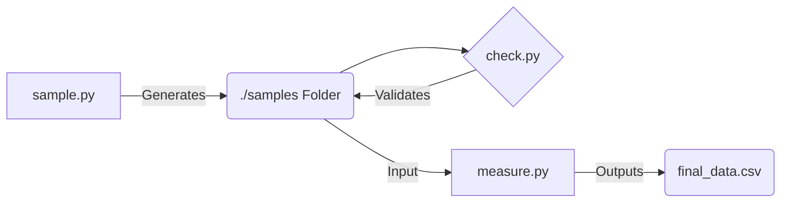

# JPEG Compression Analysis Pipeline

A Python-based toolchain designed to automate the collection, validation, and statistical analysis of image compression behavior. This project explores the non-linear relationship between JPEG Quality settings and resulting file sizes through batch processing.

## 🏗 Architecture

The pipeline consists of three modular scripts that execute sequentially:



1. **Acquisition**: `sample.py` fetches standardized raw data.
2. **Validation**: `check.py` ensures dataset integrity before processing.
3. **Analysis**: `measure.py` performs the heavy computational task of iterative compression and data logging.

---

## 1. Dataset Generator (`sample.py`)

**Role:** The entry point. It downloads random images from an external API (Lorem Picsum) to create a diverse dataset.

* **Key Behavior**: Smart caching (skips existing files), auto-resizing, and sequential naming.
* **Output**: A directory (default: `./samples`) filled with `sample_1.jpg`, `sample_2.jpg`, etc.

**Usage:**

```bash
# Download 30 images, resized to 1000x1000 pixels
python sample.py -n 30 -s 1000

```

---

## 2. Integrity Validator (`check.py`)

**Role:** Quality Control (QC). It scans the dataset to ensure no data points are missing or corrupted.

* **Why use it?** To prevent the analysis script from crashing or producing incomplete data (e.g., missing "sample_7" results in 2900 rows instead of 3000).
* **Checks Performed**: Sequence continuity (gaps in numbering) and File Header integrity (0-byte/corrupt files).

**Usage:**

```bash
# Verify the integrity of the 30 samples
python check.py -n 30

```

*If errors are found, run `sample.py` again to patch the missing files.*

---

## 3. Compression Analyzer (`measure.py`)

**Role:** The Core Processor. It treats the dataset as a read-only source and performs the experiment.

* **Process**:
1. Reads each image from the dataset.
2. Normalizes dimensions (optional but recommended).
3. Compresses the image 100 times (Quality 1 to 100).
4. Logs the resulting file size for each iteration.


* **Output**: A structured CSV file containing thousands of data points ready for regression analysis.

**Usage:**

```bash
# Run analysis and save to CSV
python measure.py -i ./samples -c result.csv

```

---

## 🚀 Workflow Example

To reproduce the experiment from scratch with a **clean 30-sample dataset**:

### Step 1: Generate Data

Fetch 30 fresh images. Use `-f` to overwrite any old data.

```bash
python sample.py -n 30 -f

```

### Step 2: Validate Data

Ensure all 30 images were downloaded correctly.

```bash
python check.py
# Expect output: "Dataset STATUS: HEALTHY"

```

### Step 3: Run Analysis

Generate the statistical data (30 images × 100 quality steps = 3000 rows).

```bash
python measure.py -c compression_data.csv

```

### Step 4: Result

You will find the data in `./out/compression_data.csv`.

---

## ⚙️ Configuration Reference

| Script | Flag | Description |
| --- | --- | --- |
| **sample.py** | `-n [int]` | Number of images to fetch. |
|  | `-s [int]` | Image resolution (). |
|  | `-f` | Force overwrite existing files. |
| **check.py** | `-n [int]` | Expected number of files to verify. |
|  | `--no-integrity` | Skip deep file verification (faster). |
| **measure.py** | `-r [int]` | Force resize during analysis (Normalization). |
|  | `-c [str]` | Output CSV filename. |